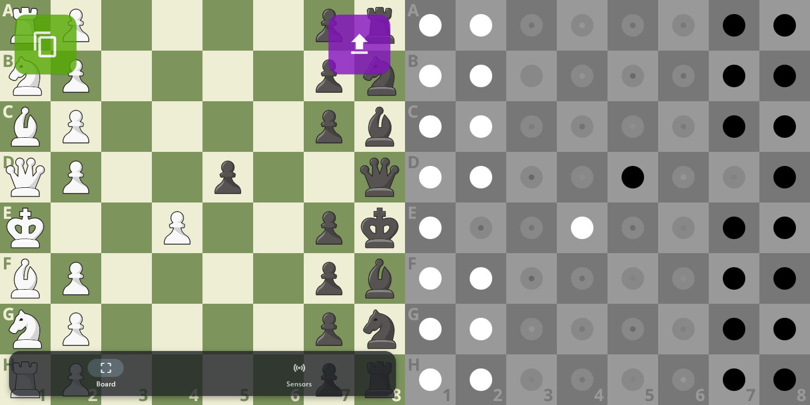

# MagChess



Magnetic chess game interpreter and recorder for the Lego [Traditional Chess Set](https://www.lego.com/en-cz/product/traditional-chess-set-40719). Game PGN can be copied to clipboard or uploaded as a Gist via Github CLI. 

## Software

Setup

```bash
pip install -r requirements.txt
rpi_install.sh
```

Run

```bash
rpi_run.sh
```

### Desktop shortcut

```ini
[Desktop Entry]
Type=Application
Name=MagChess
Icon=/home/pi/Documents/Github/MagChess/app/assets/icon.ico
Exec=/home/pi/Documents/Github/MagChess/rpi_run.sh
```

### Autostart config

```bash
mkdir -p ~/.config/autostart
nano ~/.config/autostart/magchess.desktop
```

## Hardware

The `kicad/pcb` is designed to fit the modified underside of the lego chessboard construction found in `bricklink_studio/chessboard.io`.

The PCB needs the following components soldered onto it:

- 64x SS49E hall sensor
- 4x CD74HC4067 (mux)
- ADS1015 (adc)
- MP1584EN (step down)

Each lego chess piece has to be fitted with a magnet on the bottom. Round 5x2mm magnets happen to perfectly fit into the bottom of each piece. Magnet polarity is important, if white pieces output magnetic north, black pieces should be flipped and read south. The hall sensors will then read colors as positive/negative voltage, which gives the app enough information to interpret chess moves correctly.

Finally the app should be installed onto a Raspberry Pi. The chessboard draws 5V and GND from the pi. Data pins are the I2C SDA and SCL pins and four mux selection pins, by default D21, D20, D16 and D12.

