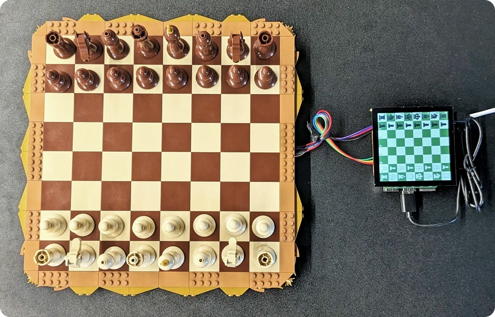
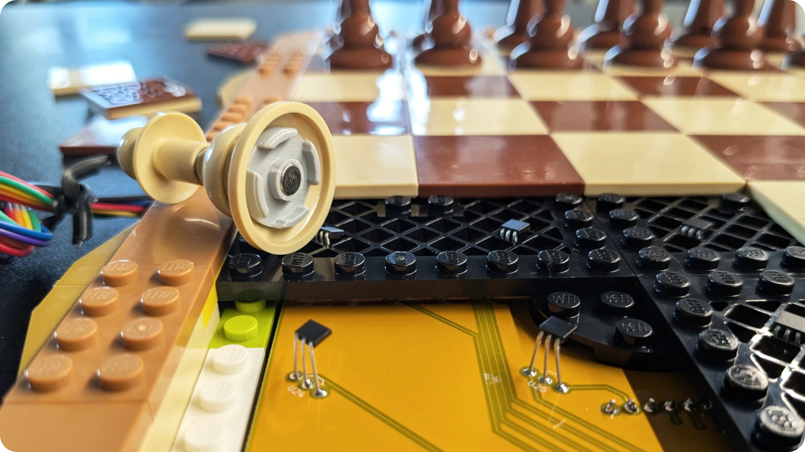
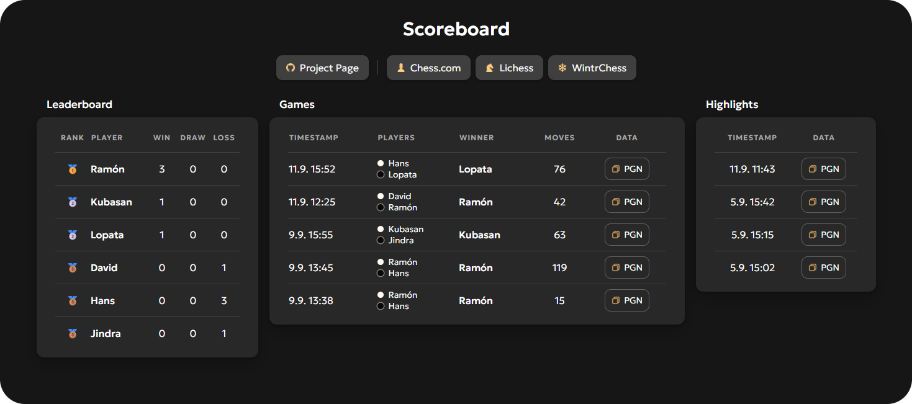

# MagChess

Magnetic chess game interpreter and PGN exporter for the Lego [Traditional Chess Set](https://www.lego.com/en-cz/product/traditional-chess-set-40719). An Astro website serves the results and shows a leaderboard.

## App


#### Setup

```bash
rpi_install.sh
```

Reboot after first installation.

#### Run

```bash
rpi_run.sh
```

### Desktop shortcut

```ini
[Desktop Entry]
Type=Application
Name=MagChess
Icon=/home/pi/Documents/Github/MagChess/app/assets/icon.ico
Exec=/home/pi/Documents/Github/MagChess/app/rpi_run.sh
Category=Game
```

### Autostart config

```bash
mkdir -p ~/.config/autostart
nano ~/.config/autostart/magchess.desktop
```

## Hardware



The PCB in `kicad/pcb` is designed to fit a modified underside of the lego chessboard construction found in `bricklink_studio/chessboard.io`.

The PCB needs the following components soldered onto it:

- 64x SS49E
- 4x CD74HC4067
- ADS1015
- MP1584EN

Each lego chess piece has to be fitted with a magnet on the bottom. Round 5x2mm magnets happen to fit perfectly into the bottom of each piece.

Magnet polarity is important, if white pieces read magnetic north, black pieces should be flipped and read south. The hall sensors will then read colors as positive/negative voltage, which gives the app enough information to interpret chess moves correctly.

The app should be installed on a Raspberry Pi. The chessboard draws 5V and GND from the pi. Data pins are the I2C SDA and SCL pins and four mux selection pins, by default D21, D20, D16 and D12. An estimated 800mA is drawn by the hall sensors when powered.

## Scoreboard



<div align="center">
    <a href="https://swift502.github.io/MagChess">https://swift502.github.io/MagChess</a>
</div>
<br>

Astro website showing leaderboards and games history archive. Deployed via GitHub Pages.

### Build notes

```bash
npm install
npm run dev
npm run build
```